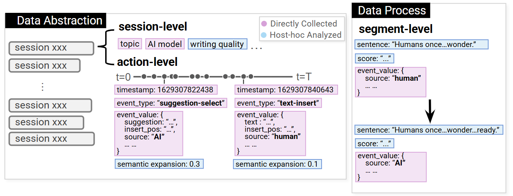

# InkPulse: Understanding Interactions in Human-AI Co-writing through Fuzzy Visual Patterns

## Introduction

The repository is for InkPulse, a visual analytics system that supports the identification, search, and
analysis of key interactions in human-AI co-writing.

The introduction video can be found [here](https://drive.google.com/file/d/10hUfbSWKgs8HGooqmY0QcR2q3_x5e5AH/view?usp=sharing).

https://github.com/user-attachments/assets/52fd3243-0cf5-4943-a456-d8fd09c1538b

## Quick Link

[Getting Started](#getting-started)

[Project Structure](#project-structure)

[File Structure](#file-structure)

[Data Structure](#data-structure)

[How to import your own dataset](#how-to-import-your-own-dataset)

## Getting Started

If running for the first time, ensure you have Node.js **v18 or newer** installed. You can check your version by running:

```bash
node -v
```

Install all dependencies by using: 

```bash
npm install
```

Then, run the development server:

```bash
npm run dev
# or
yarn dev
# or
pnpm dev
# or
bun dev
```

Open [http://localhost:5173](http://localhost:5173) with your browser to see the result.

## Project Structure

This project is organized with the following structure(only list main folders):


### File Structure

- **`/src/routes/`**  
  Contains the main application routes.

- **`/src/components/`**  
  Contains the key components used throughout the project, such as charts.

- **`/static/backend/`**  
  Contains code related to data processing. The main file for data processing is `index.py`, and additional processing logic is contained in `/static/backend/process`.

- **`/static/dataset/`**  
  Contains the processed datasets that are used by the application.

- **`/static/import_dataset/`**  
  Contains the raw data files.

- **`/static/pattern/`**  
  Contains saved patterns.

## Data Structure

We use three main data structures in this project, including raw data in the following description.



**`static/import_dataset`**: Contains raw data.

**`static/dataset/json`**: [**action-level**]Contains each action, used for displaying points in line chart.

**`static/dataset/segment`**: Contains each segment, used for calculating the data in **`static/dataset/segment_results`**.

**`static/dataset/segment_results`**: [**segment-level**]Contains data for each segment, used for displaying bars in bar chart.

### static/import_dataset
Stores raw data.
  ```python
    {
      "eventName": str,
      "eventSource": str,
      "eventTimestamp": int,
      "textDelta": {
          "ops": list[{
              "retain": int,
              "insert": str
          }]
      }
    }
  ```
Example
  ```python
  {"eventName": "text-insert", "eventSource": "api", "eventTimestamp": 1629952145999, "textDelta": {"ops": [{"retain": 2793}, {"insert": "We need to be able to..."}]}, ...}
  {"eventName": "text-insert", "eventSource": "user", "eventTimestamp": 1629952147848, "textDelta": {"ops": [{"retain": 2919}, {"insert": " "}]}, ...}
  ```

### static/dataset/json
Stores user actions on text, including content and event metadata. Extracts featrues from raw data.
  ```python
    from_json(
      "init_text": List[str],
      "init_time": List[str],
      "text": List[str],
      "info": List[Dict[str, Any]]
        [
          id: int,
          name: "suggestion-open" | "text-insert" | "text-delete",
          eventSource: str,
          event_time: str,
          event_progress: float
        ]
    )
  ```

  - **init_text**: Initial text representing the topic
  - **init_time**: Timestamp indicating when the initial text was presented
  - **text**: Full text content
  - **info**: Present each action
    - **id**: Unique identifier of the operation
    - **name**: Name of the action
    - **text**: The text content involved in the action
    - **eventSource**: Source of the action
    - **event_time**: Timestamp of the action
    - **event_progress**: Progress of the action
    - **count**: Number of characters
    - **pos**: Position of characters

Example
  ```python
  {
    "init_text": [
        "Humans once wielded formidable magical power..."
    ],
    "init_time": [
        "2021-08-17 07:22:04"
    ],
    "text": [
        "Humans once wielded formidable magical power..."
    ],
    "info": [
        {
            "id": 2,
            "name": "suggestion-open",
            "eventSource": "api",
            "event_time": "2021-08-17 07:22:12"
        },
        {
            "id": 9,
            "name": "text-insert",
            "text": "\nThe world is a dangerous place, but it is also filled with wonder.\n",
            "eventSource": "api",
            "event_time": "2021-08-17 07:22:17",
            "count": 68,
            "pos": 272,
            "progress": 0.11647824597464886
        },
      ...
    ]
  }
  ```
### static/dataset/segment
Stores intermediate segment-level data for computing following data. **NOT** directly used in the frontend. Segments the sentence from the json data, calculates the progress and time. 

  ```python
    List[
      {
        text: str,
        source: str,
        start_time: float,
        end_time: float,
        last_event_time: float,
        start_progress: float,
        end_progress: float
      }
    ]
  ```
  - **text**: Current context
  - **source**: Source of current context
  - **start_time**: Start time of current context
  - **end_time**: End time of current context
  - **last_event_time**: End time of the session
  - **start_progress**: Start progress of current context
  - **end_progress**: End progress of current context

Example
  ```python
    List[
      {
          "text": "Humans once wielded formidable magical power. But with over 7 billion of us on the planet now, Mana has spread far too thinly to have any effect. When hostile aliens reduce humanity to a mere fraction, the survivors discover an old power has begun to reawaken once again.\n",
          "source": "api",
          "start_time": 0.0,
          "end_time": 0.0,
          "last_event_time": 0.0,
          "start_progress": 0,
          "end_progress": 0.09318259677971909
      },
      {
          "text": "Humans once wielded formidable magical power. But with over 7 billion of us on the planet now, Mana has spread far too thinly to have any effect. When hostile aliens reduce humanity to a mere fraction, the survivors discover an old power has begun to reawaken once again.\n\nThe world is a dangerous place, but it is also filled with wonder.\n",
          "source": "api",
          "start_time": 8.0,
          "end_time": 13.0,
          "last_event_time": 13.0,
          "start_progress": 0.09318259677971909,
          "end_progress": 0.11647824597464886
      },
      ...
    ]
  ```

### static/dataset/segment_results
Stores segment-level data for analysis and visualization. Calculates scores and covert str data(sentence) into float data. 

  ```python
    List[
      {
          "sentence": float,
          "source": str,
          "start_progress": float,
          "end_progress": float,
          "start_time": float,
          "end_time": float,
          "last_event_time": float,
          "residual_vector_norm": float,
          "score": int
      }
    ]
  ```

  - **sentence**: Length of the segment
  - **source**: Source of current context
  - **start_progress**: Start progress of current context
  - **end_progress**: End progress of current context
  - **start_time**: Start time of current context
  - **end_time**: End time of current context
  - **last_event_time**: End time of the session
  - **residual_vector_norm**: Semantic expansion score
  - **score**: LLM evaluation score for the full context

Example
  ```python
    [
      {
          "sentence": 0.09066666666666667,
          "source": "api",
          "start_progress": 0,
          "end_progress": 0.09318259677971909,
          "start_time": 0.0,
          "end_time": 0.0,
          "last_event_time": 0.0,
          "residual_vector_norm": 0.0,
          "score": 6
      },
      {
          "sentence": 0.11333333333333333,
          "source": "api",
          "start_progress": 0.09318259677971909,
          "end_progress": 0.11647824597464886,
          "start_time": 8.0,
          "end_time": 13.0,
          "last_event_time": 13.0,
          "residual_vector_norm": 0.7351918841534578,
          "score": 6
      },
      ...
    ]
  ```

## How to import your own dataset

You can use **`static/backend/index.ipynb`** to preprocess the data.

Before loading your dataset, please check the data structure above.

Put your dataset in folder **`static/import_dataset`**

Your dataset should contains:

1. data/session.jsonl

2. data.csv

session.jsonl format should be similar as the raw data above.

dataset.csv should contain at least **session_id** and **prompt_code**. Sample can be checked in **`static/import_dataset/creative.csv`**.